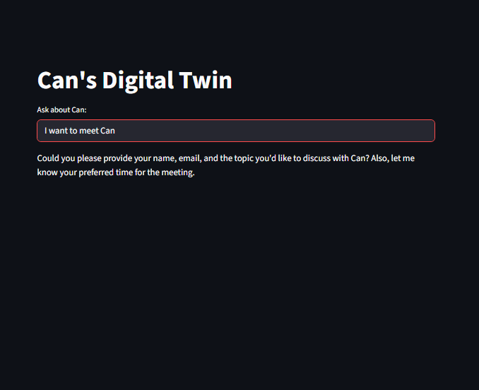
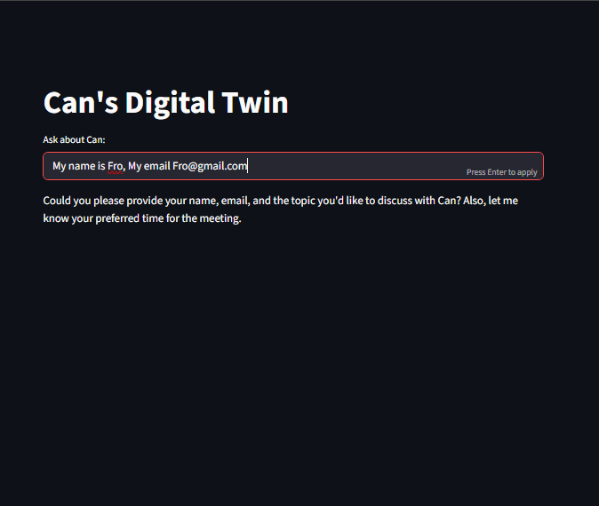
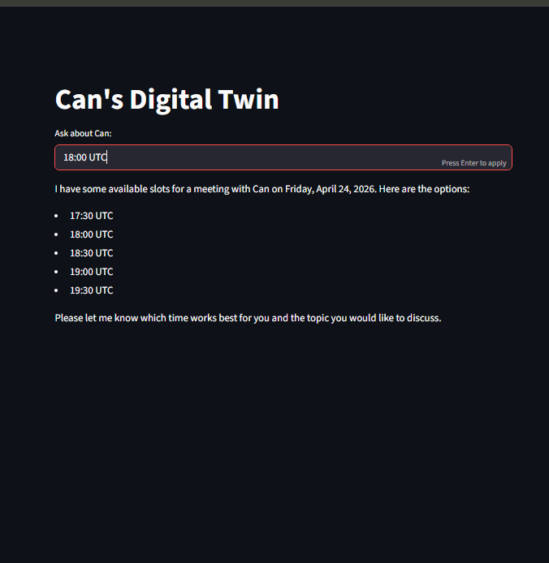
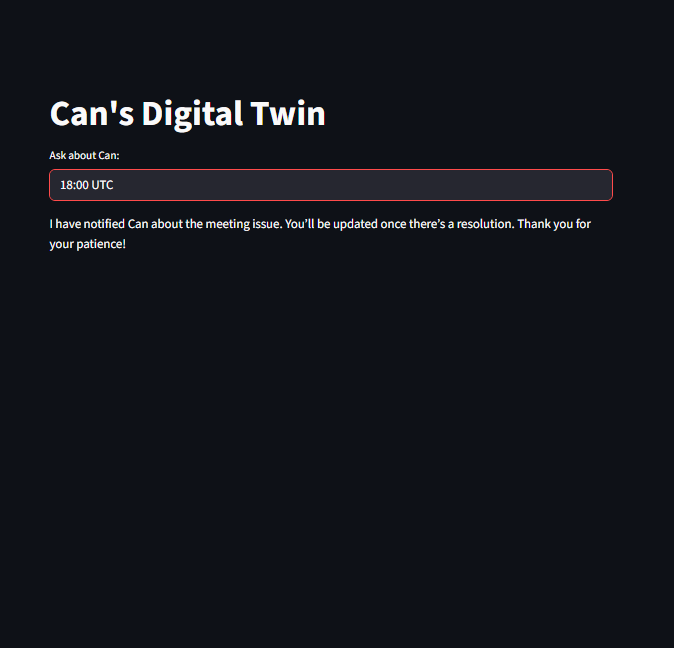
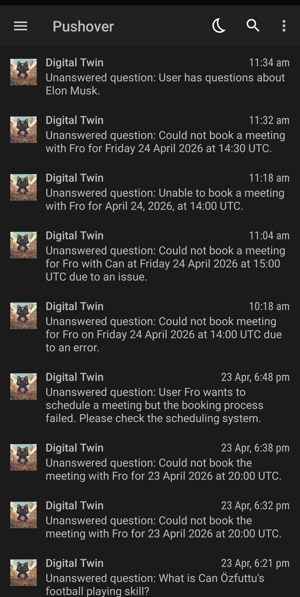

# Can's Digital Twin

An AI agent that acts as Can Özfuttu's digital twin with RAG knowledge base, Calendly integration, and automatic contact extraction.

## Features
- Answers questions about Can using knowledge base
- Schedules meetings via Calendly
- Automatically detects self-introductions and saves contact info to CSV
- Notifies owner for unknown questions

## Contact Extraction Feature

The agent intelligently detects when users introduce themselves and saves their details.

### Example 1: Hiring Introduction

### Example 2: Collaboration Introduction

### Saved Contacts (contacts.csv)

## Setup
1. Clone the repo
2. `pip install -r requirements.txt`
3. Add your `.env` variables (OpenRouter, Calendly, etc.)
4. Run `streamlit run app.py`

### Current Blocker: Calendly Booking Issue
I am currently encountering a critical issue with the automated booking tool. While the knowledge search and notification tools are functional, the book meeting function is failing during execution.

### Screenshots

